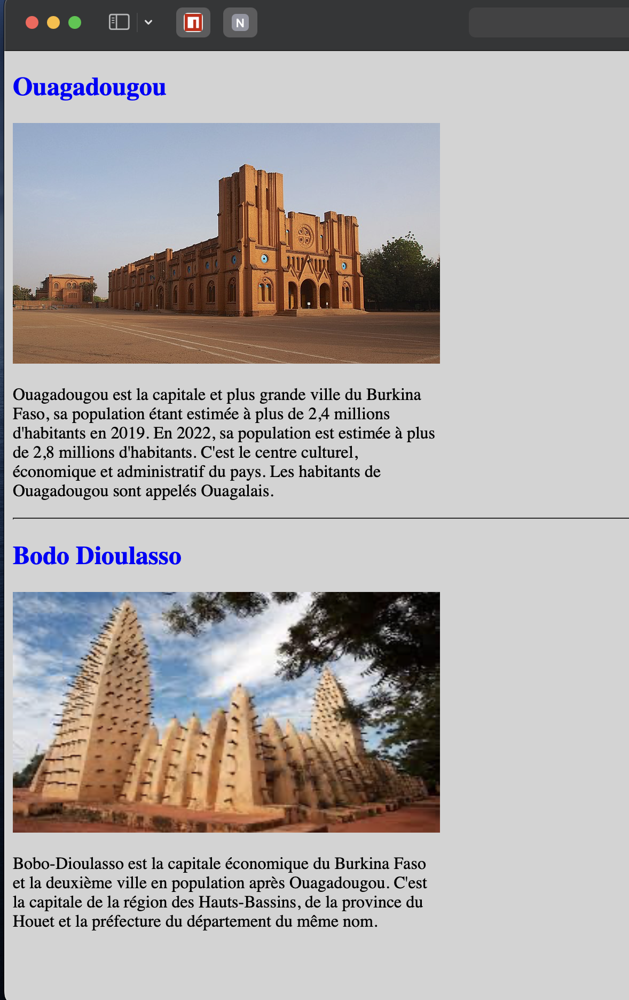

# Exercice de Maison - Reproduction de la Page HTML

## Objectif
Reproduire la mise en page et le contenu affichés dans l'image "hw_img_1.png" en utilisant le code HTML fourni.

## Étapes à suivre

### 1. Structuration du contenu
- Utilisez les balises HTML appropriées pour structurer le contenu de la page. Vous avez déjà les balises `
`, `<h2>`, ``, et `
` à votre disposition.

### 2. Ajout de styles
- Utilisez les attributs `style` des balises HTML pour appliquer les styles CSS nécessaires. Les styles sont déjà définis directement dans le code HTML, vous n'avez pas besoin de créer un fichier CSS externe.

### 3. Reproduction de la première section (Ouagadougou)
- Reproduisez la première section en utilisant les balises `<h2>`, `` et `
` pour afficher le titre, l'image et le paragraphe correspondants. Assurez-vous de conserver les attributs `width` et `height` pour l'image.

### 4. Ajout d'une ligne de séparation
- Insérez une balise `
` entre les deux sections pour créer une ligne de séparation.

### 5. Reproduction de la deuxième section (Bobo Dioulasso)
- Reproduisez la deuxième section en suivant les mêmes étapes que pour la première section.

### 6. Test et validation
- Vérifiez que la mise en page et le contenu de votre page HTML correspondent à ce qui est affiché dans l'image "hw_img_1.png".
- Testez votre page dans différents navigateurs et assurez-vous que le rendu est cohérent.

## Challenge
- Créez deux classes CSS : une pour les titres (`header-class`) et une pour les paragraphes (`paragraph-class`).
- Appliquez ces classes aux balises `<h2>` et `
` respectivement.
- Utilisez les classes CSS pour styliser les titres et les paragraphes selon les spécifications de l'image "hw_img_1.png".

## Ressources
- Utilisez l'image "Ouagadougou.jpg" pour la première section et l'image "bobo.jpeg" pour la deuxième section.
- Utilisez le texte fourni ci-dessous dans les paragraphes pour les deux sections.

- Text Pour Ouagadougou: 
        Ouagadougou est la capitale et plus grande ville du Burkina Faso, sa
        population étant estimée à plus de 2,4 millions d'habitants en 2019. En
        2022, sa population est estimée à plus de 2,8 millions d'habitants.
        C'est le centre culturel, économique et administratif du pays. Les
        habitants de Ouagadougou sont appelés Ouagalais.
- Text Pour Bobo Dioulasso:
        Bobo-Dioulasso est la capitale économique du Burkina Faso et la deuxième
        ville en population après Ouagadougou. C'est la capitale de la région
        des Hauts-Bassins, de la province du Houet et la préfecture du
        département du même nom.

## Aperçu de l'image

